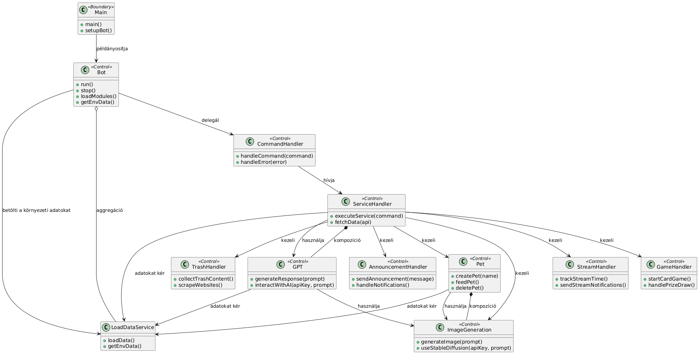

# CsaládGPT v3.0 Discord bot

---

## 1. Összefoglaló

---
**_CsaládGPT_** egy közösségi _Discord_ bot, melyet egy magyar nyelvű streamer rajongói szerverére fejlesztettem. A bot
jelenleg is fejlesztés alatt áll, folyamatosan bővülő funkciókkal, hogy egyedi és szórakoztató élményt nyújtson a
közösség számára.

---

## 2. A projekt bemutatása

---

Ez a projektterv a **_CsaládGPT_** _Discord_ bot projektet mutatja be, amely fejlesztése `2023-10-30`-tól `2025-01-20`,
azaz összesen `448` napon
keresztül készül. A projekten egy fejlesztő dolgozik.

---

## 2.1 Rendszerspecifikáció

---

A _Discord_ bot célja egy szórakoztató és felhasználóbarát közösségi alkalmazás létrehozása, ahol a felhasználók
különböző, a közösségen belül ismert mémekből ihletődött funkciók használatával gazdagítsák a szerver életét. A bot
lehetővé teszi a streamer által indított stream maraton, ismertebb nevén, "**Endless Selchris Stream**", idejének
nyomonkövetése, "**istenóra**" használása, képekgenerálása, chatbot funkciók használata, xp-rangrendszer, pet, "trash"
trartalmak, bejelentések, nyereményjátékok funcióinak használata.

---

## 2.2 Funkcionális követelmények

---

- Stream-ből visszamardt idő nyomonkövetése. (`CRU`)
- _Istenóra_ használata (`R`)
- Chat funkciók (privát chat, role-ok, custom gpt-k) használata (`OpenAI API`)
- Stream értesítő küldése (`Webscrapping/YoutubeAPI`)
- XP-rangrendszer, szinthez járó előnyökkel (`CRUD`)
- Képgenerálás (`OpenAI API, StableDiffusion API`)
- Nyereményjátékok (`CRD`)
- Bejelentések
- Trash tartalmak (`Webscrapping`)
- Pet (`CRUD`) (`OpenAI API`)
- Javaslat küldése
- _Jimmy_ idézetek (`R`)
- Insult (`R`)
- Valuták "percre" váltása
- Anime kereső funkciók (`trace.moe API`)
- Játékokkal kapcsolatos funkciók (`IGDB API`)
- Kártyajáték (`Deck of Cards API`)

---

### 2.2.1 Funkcionális követelmények dokumentációja

---

Minden funkcióhoz tartozik egy dokumentáció, mely tartalmazza annak leírását, működését, a hozzá tartozó parancsokat, és
a funkcióhoz szükséges technológiákat.
Dokumentációk:

- [Stream-ből visszamardt idő nyomonkövetése]()
- [_Istenóra_ használata]()
- [Chat funkciók]()
- [Stream értesítő küldése]()
- [XP-rangrendszer, szinthez járó előnyökkel]()
- [Képgenerálás]()
- [Nyereményjátékok]()
- [Bejelentések]()
- [Trash tartalmak]()
- [Pet]()
- [Javaslat küldése]()
- [_Jimmy_ idézetek]()
- [Insult]()
- [Valuták "percre" váltása]()
- [Anime kereső funkciók]()
- [Játékokkal kapcsolatos funkciók]()
- [Kártyajáték]()

## 2.3 Nem funkcionális követelmények

---

- A _Discord_ bot lehetőleg gyorsan és simán üzemeljen
- Felhasználó barát felépítése legyen
- Egyértelmű és könnyen megjegyezhető parancsok
- Szerveren tárolt adatok átláthatósága
- A legfrissebb technológiákat használja a rendszer
- A bot skálázható legyen, hogy több felhasználó a szerverre csatlakozzáskor is folyamatos működést biztosítson
- Adatbiztonság

---

## 3. Munkakörnyezet

---
A projekt a következő munkaállomásokat fogja használni a munka során:

- Munkaállomások: 2 db, Windows 11 operációs rendszerrel:
    - ASUS Zenbook DUO 14 (Intel i7-1165G7, 16GB RAM, 1TB SSD, Intel Iris Xe)
    - PC (Nvidia RTX 3060, Intel i7-10700K, 32GB RAM, 1TB SSD, 4TB HDD)

A projekt a következő technológiákat/szoftvereket fogja használni a munka során:

- Discord API
- OpenAI API
- Youtube API
- Webscrapping
- Deck of Cards API
- IGDB API
- Trace.moe API
- StableDiffusion API
- DigitalOcean által biztosított SQL adatbázis (`PostgreSQL`)
- Pycharm IDE
- Docker
- Git
- Github
- JSON

---

## 4. Kommunikáció és API integráció

---

A projekt során több API-t is felhasználok. Az ezekkel való kommunikáció és ezek integrálásáról az alábbi dokumentációk
írnak:

- [OpenAI API](https://beta.openai.com/docs/)
- [Youtube API](https://developers.google.com/youtube/v3)
- [Deck of Cards API](https://deckofcardsapi.com/)
- [IGDB API](https://api-docs.igdb.com/)
- [Trace.moe API](https://soruly.github.io/trace.moe-api/)
- [Discord API](https://discord.com/developers/docs/intro)
- [StableDiffusion API]()

---

## 5. Tesztelési terv

---

- A projekt kezdeti szakaszában manuális tesztelési módszereket fogok alkalmazni.
- Várhatóan az **M2** fázisban elengedhetetlen lesz felhasználói tesztelés, melyet a közösség tagjai segítségével fogok
  végezni.
- **M4** fázisban már automatizált tesztelési módszereket is alkalmazni fogok.

## 6. A munka tartalma

---

A projekt hét mérföldkövet tartalmaz, melyek a következők:

| Mérföldkő | Megnevezés                          | Határidő   | Állapot        |
|-----------|-------------------------------------|------------|----------------|
| M1        | Dokumentáció, projekt előkészítés   | 2024-10-20 | Folyamatban    |
| M2        | Alap funkciók                       | 2024-11-20 | Nincs elkezdve |
| M3        | Rangrendszer                        | 2024-12-10 | Nincs elkezdve |
| M4        | Áttérés felhőszolgáltatásra         | 2024-12-15 | Nincs elkezdve |
| M5        | Kibővített Chat funkciók            | 2024-12-20 | Nincs elkezdve |
| M6        | Automatizált funkciók               | 2025-01-10 | Nincs elkezdve |
| M7        | Egyéb, alacsony prioritású funkciók | 2025-01-20 | Nincs elkezdve |

---

## 7. A projekthez tartozó diagramok, jegyzetek

---

### 7.1 Use-case diagram

---

---

### 7.2 Class diagram

---

---

### 7.3 Sequence diagram

---

---

### 7.4 Package diagram

---

---

### 7.5 Entity diagram

---

---

### 7.6 Jegyzetek

---

Még nincs.

---

2024-10-11, Szeged