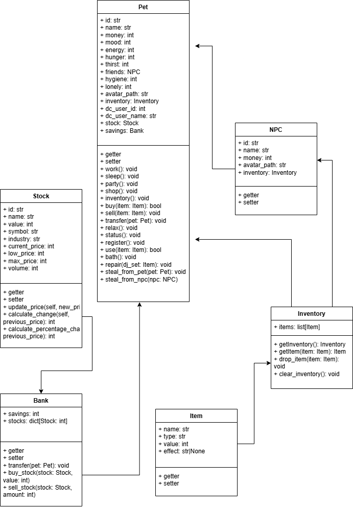

# Pet

---

## 1. változat

---

### Selchris pet

A user képes regisztrálni egy Selchris petet.
A pet a következőket tudja:

---

| Név            | Típus       | Szint   | Következmény (sikeres)                                          | Következmény (sikertelen)                                       |
|----------------|-------------|---------|-----------------------------------------------------------------|-----------------------------------------------------------------|
| Munka          | Pénzszerzés | 0       | ++pénz, -energia, -kedv, +magány, +éhség, +szomjúság, -higénia  | +pénz, --energia, --kedv, +magány, +éhség, +szomjúság, -higénia |
| Party          | Szórakozás  | 0       | -pénz, -energia, ++kedv, --magány, +éhség, -szomjúság, -higénia | --pénz, --energia, +kedv, -magány, +éhség, -szomjúság, -higénia |
| Pihenés        | Pihenés     | 0       | ++energia, +kedv, +magány, +éhség, +szomjúság                   | +energia, +kedv, +magány, +éhség, +szomjúság                    |
| Alvás          | Pihenés     | 0       | +++energia, -higénia, +éhjség, +szomjúság                       | ------- ? KELL?                                                 |
| Bolt           | vásárlás    | 2       | ------- NINCS                                                   | ------- NINCS                                                   |
| Vásárlás       | vásárlás    | 2       | ------- NINCS                                                   | ------- NINCS                                                   |
| Inventory      | egyéb       | 0       | ------- NINCS                                                   | ------- NINCS                                                   |
| Státusz        | egyéb       | 0       | ------- NINCS                                                   | ------- NINCS                                                   |
| Evés           | használat   | 0       | ------- NINCS                                                   | ------- NINCS                                                   |
| Ivás           | használat   | 0       | ------- NINCS                                                   | ------- NINCS                                                   |
| Tárgyhasználat | használat   | 0       | ------- NINCS                                                   | ------- NINCS                                                   |
| Bank           | pénzkezelés | 1       | ------- NINCS                                                   | ------- NINCS                                                   |
| Részvények     | pénzkezeés  | 3       | ------- NINCS                                                   | ------- NINCS                                                   |
| Tisztálkodás   | higénia     | 0       | ------- NINCS                                                   | ------- NINCS                                                   |
| Javítás        | egyéb       | (skill) | -pénz, -energia, +kedv, +éhség, +szomjúság, -higénia            | --pénz, --energia, --kedv, +éhség, +szomjúság, --higénia        |
| Eladás         | egyéb       | 1       | ------- NINCS                                                   | ------- NINCS                                                   |

---

---

### Leírások:

---

- Munka:
    - Szükséges szint: **0**
    - Szükséges: **energia**, **kedv**, **éhség**, **szomjúság**, **DJ set** (ha van)
    - Két lehetséges kimenetel van: __**sikeres**__ és __**sikertelen**__
    - Selchris tud dolgozni. Ilyenkor a user dönthet, hogy vagy DJ munkát vállal (ezzel a DJ set használódik), vagy
      egyéb alkalmi munkát.

    - **DJ munka**:
        - **Sikeres**:
            - **Pénz**: 1200 - 1600
            - **Energia**: -10 - -15
            - **Kedv**: -5 - -10
            - **Magány**: +2 - +5
            - **Éhség**: +2 - +10
            - **Szomjúság**: +2 - +10
            - **Higiénia**: -5 - -10
            - **DJ set**: -1 - -5
        - **Sikertelen**:
            - **Pénz**: 200 - 350
            - **Energia**: -15 - -30
            - **Kedv**: -10 - -20
            - **Magány**: +5 - +10
            - **Éhség**: +2 - +10
            - **Szomjúság**: +2 - +10
            - **Higiénia**: -5 - -10
            - **DJ set**: -3 - -10

    - **Egyéb munka**:
        - **Sikeres**:
            - **Pénz**: 200 - 500
            - **Energia**: -10 - -20
            - **Kedv**: -5 - -10
            - **Magány**: +2 - +5
            - **Éhség**: +2 - +10
            - **Szomjúság**: +2 - +10
            - **Higiénia**: -5 - -10
        - **Sikertelen**:
            - **Pénz**: 50 - 150
            - **Energia**: -15 - -30
            - **Kedv**: -10 - -20
            - **Magány**: +5 - +10
            - **Éhség**: +2 - +10
            - **Szomjúság**: +2 - +10
            - **Higiénia**: -5 - -10

    - Minden esetben a munka a következőket adja jutalmul: **pénz**
    - Minden esetben a munka a következőket veszi el: **energia, kedv**
    - A munka növeli a **magány**, **éhség**, **szomjúság** érzetét, és csökkenti a **higiénia** érzetét.

- Party:
    - Szükséges szint: **0**
    - Szükséges: **pénz**, **energia**, **kedv**, **éhség**, **szomjúság**, higénia, **barátok** (ha van)
    - Két lehetséges kimenetel van: __**sikeres**__ és __**sikertelen**__
    - Selchris tud bulizni. Ilyenkor a user dönthet, hogy vagy egyedül megy el, vagy barátokkal (ha van).
    - **Egyedül**:
        - **Sikeres**:
            - **Pénz**: -100 - -150
            - **Energia**: -10 - -15
            - **Kedv**: +10 - +20
            - **Magány**: -5 - -10
            - **Éhség**: +2 - +10
            - **Szomjúság**: -5 - -10
            - **Higiénia**: -5 - -10
            - **Barátok**: +1 (esemény (rnd) alapján, npc)
        - **Sikertelen**:
            - **Pénz**: -150 - -180
            - **Energia**: -15 - -30
            - **Kedv**: -10 - -20
            - **Magány**: +5 - +10
            - **Éhség**: +2 - +10
            - **Szomjúság**: -5 - -10
            - **Higiénia**: -5 - -10
            - **Barátok**: 0
          
    - **Barátokkal**:
        - **Sikeres**:
            - **Pénz**: -150 - -200
            - **Energia**: -20 - -25
            - **Kedv**: +50 - +70
            - **Magány**: -15 - -20
            - **Éhség**: +10 - +20
            - **Szomjúság**: -10 - -20
            - **Higiénia**: -10 - -15
            - **Barátok**: +1 (esemény (rnd) alapján, npc)
        - **Sikertelen**:
            - **Pénz**: -200 - -250
            - **Energia**: -25 - -30
            - **Kedv**: -20 - -30
            - **Magány**: +10 - +20
            - **Éhség**: +10 - +20
            - **Szomjúság**: -10 - -20
            - **Higiénia**: -10 - -15
            - **Barátok**: -1 (esemény (rnd) alapján, npc)

    - Minden esetben a parti a következőket adja jutalmul: **kedv**, **barátok (ha sikeres)**, **szomjúság**
    - Minden esetben a parti a következőket veszi el: **pénz**, **energia**, **magány**, **éhség**, **higiénia**
    - A parti növeli a **kedv** érzetét, és csökkenti a **pénz**, **energia**, **magány**, **éhség**, **szomjúság**
      érzetét, és csökkenti a **higiénia** érzetét.
  
- Pihenés:
    - Szükséges szint: **0**
    - Szükséges: semmi
    - Egy lehetséges kimenetel van: __**sikeres**__
    - Selchris tud pihenni. 
    - **Sikeres**:
        - **Energia**: +10 - +20
        - **Kedv**: +10 - +20
        - **Magány**: -5 - -10
        - **Éhség**: +2 - +10
        - **Szomjúság**: +2 - +10
        - **Higiénia**: +5 - +10

    - Minden esetben a pihenés a következőket adja jutalmul: **energia**, **kedv**, **higiénia**
    - Minden esetben a pihenés a következőket veszi el: semmi
    - A pihenés növeli az **energia**, **kedv**, **magány**, **éhség**, **szomjúság**, **higiénia** érzetét.

- Alvás:
  - Szükséges szint: **0**
  - Szükséges: semmi
  - Egy lehetséges kimenetel van: __**sikeres**__
  - Selchris tud aludni.
  - **Sikeres**:
    - **Energia**: MAX
    - **Kedv**: +5 - +10
    - **Éhség**: +2 - +6
    - **Szomjúság**: +2 - +6
    - **Higénia**: -2 - -6
    
  - Minden esetben az alvás a következőket adja jutalmul: **energia**, **kedv**
  - Minden esetben az alvás a következőket veszi el: semmi
  - Az alvás növeli az **energia**, **kedv**, **éhség**, **szomjúság** érzést. Csökkenti a **higénia** érzést
- Bolt:
  - Szükséges szint: **2**
  - Szükséges: semmi
  - Megnyílik egy menü, ahol a user vásárolhat.
  - Lehetséges áru kategóriák:
    - **Étel**: +éhség, +szomjúság
    - **Ital**: +szomjúság
    - **Higiénia**: +higiénia
    - **Egyéb**: +éhség, +szomjúság, +higiénia, +kedv, +magány
- Vásárlás:
  - Szükséges szint: **2**
  - Szükséges: **pénz**
  - Selchris tud vásárolni.
- Inventory:
  - Szükséges szint: **0**
  - Szükséges: semmi
  - Megnyílik egy menü, ahol a user láthatja a tárgyait.
- Státusz:
  - Szükséges szint: **0**
  - Szükséges: semmi
  - Megnyílik egy menü, ahol a user láthatja a státuszát.
- Evés:
  - Szükséges szint: **0**
  - Szükséges: **élelem**
  - Selchris tud enni.
- Ivás:
  - Szükséges szint: **0**
  - Szükséges: **ital**
  - Selchris tud inni.
- Tárgyhasználat:
  - Szükséges szint: **0**
  - Szükséges: **tárgy**
  - Selchris tud tárgyat használni.
- Bank:
  - Szükséges szint: **1**
  - Szükséges: **pénz**
  - Selchris tud pénzt kezelni.
  - Lehetséges funkciók:
    - **Befizetés**: +pénz
    - **Kifizetés**: -pénz
    - **Átutalás**: -pénz (másik usernek)
    - **Hitel**: +pénz
    - **Törlesztés**: -pénz
    - **Megtakarítás**: +pénz
- Részvények:
  - Szükséges szint: **3**
  - Szükséges: **pénz**
  - Selchris tud részvényekkel kereskedni.
  - Lehetséges funkciók:
    - **Vásárlás**: -pénz
    - **Eladás**: +pénz
    - **Árak**: változóak
    - **Hírek**: változóak
- Tisztálkodás:
  - Szükséges szint: **0**
  - Szükséges: semmi
  - Selchris tud tisztálkodni.
- Javítás:
  - Szükséges szint: **(skill)**
  - Szükséges: **pénz**
  - Selchris tud javítani.
  - **Sikeres**:
    - **Pénz**: -100 - -200
    - **Energia**: -10 - -20
    - **Kedv**: +10 - +20
    - **Éhség**: +2 - +10
    - **Szomjúság**: +2 - +10
    - **Higiénia**: -5 - -10
  - **Sikertelen**:
    - **Pénz**: -200 - -300
    - **Energia**: -20 - -30
    - **Kedv**: -10 - -20
    - **Éhség**: +2 - +10
    - **Szomjúság**: +2 - +10
    - **Higiénia**: -5 - -10
- Eladás:
  - Szükséges szint: **1**
  - Szükséges: **tárgy**
  - Selchris tud eladni.

---

---

Külön UI elemek minden fontosabb funkcióhoz.
Pixel art stílusú karakterek
Küldetések, amiket a user teljesíthet.
Képességek, amiket a user fejleszthet.
NPC-k, akikkel a user interakcióba léphet. (pl buli, munka)
gombok
modal?

Minden user csak egy petet tud regisztrálni.
Minden usernek van egy küldetés sorozata, amit teljesítenie kell. Fő cél: Tommorowlandre eljutni.
A userek nem tudnak új petet regisztrálni, ha már van egy. Ergó, nincs új játék. (?)

szintrendszer 1-10
achievementek

Lehet ruhákat vásárolni, amiket a pet viselhet és ezek módosítják a kinézetét.

### Részvény:
szimulát részvénypiac. A user vásárolhat és eladhat részvényeket. A részvények ára változó, és a hírek (random ai generált hírek) befolyásolják.
A usernek van egy saját portfóliója, ahol láthatja a részvényeit, azok árát, és a híreket.
4 óránként frissülnek az árak és a hírek (ha lesz hír).
diagramok, grafikonok (ui). értesítő?

3-6 részvény:
- név
- ár
- hír
- grafikon

3-6 kriptó:
- név
- ár
- hír
- grafikon

---

random események, random időközönként amik befolyásolják az aznapi történéseket. (árak, hírek, stb.) (időjárás,...)

---

---

## 2. változat

---

### Saját pet
Karakter editor, név, kinézet, stb.
Állat, ember, bármi más?

---

